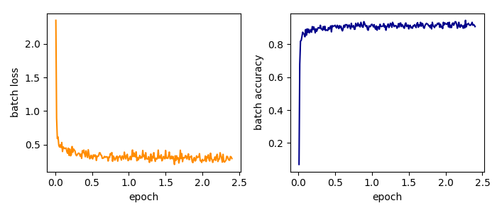

- [Second-order optimization of a simple network on MNIST](#org20ae2e8)
  - [Load MNIST](#org8c5a12c)
  - [Model](#orgdab1243)
  - [Loss function](#orgabfd5d7)
  - [Optimizer](#orgb4e1f86)
  - [Run training](#orga7c3ea6)
    - [Specify the curvature matrix](#orgd0e2caf)
    - [The training loop](#org067ce4e)
  - [References](#org518108a)


<a id="org20ae2e8"></a>

# Second-order optimization of a simple network on MNIST

(Get the `Python` script [here](01_single_layer_mnist.py))

This tutorial illustrates how to use Hessian backpropagation (HBP) for training a simple neural networks on the MNIST dataset with a second-order method.

In particular, we focus on the additional lines that have to be added to an already existing training procedure for out-of-the-box `PyTorch` optimizers.

Let's do this! First, some imports (ignore them, we will come back to them soon).

```python
# data loading
import torchvision
import torchvision.transforms as transforms
from os import path

# layers
import torch
from torch.nn import CrossEntropyLoss
from bpexts.hbp.linear import HBPLinear

# for HBP
from bpexts.hbp.loss import batch_summed_hessian

# optimizer
from bpexts.optim.cg_newton import CGNewton

# auxiliary
from bpexts.utils import set_seeds
```

-   If there is a GPU on your device, we can make use of it
    
    ```python
    device = torch.device('cuda:0' if torch.cuda.is_available() else 'cpu')
    ```

-   For reproducibility, let us fix the random seed
    
    ```python
    set_seeds(0)
    ```


<a id="org8c5a12c"></a>

## Load MNIST

The MNIST dataset contains images of 28x28=784 pixels categorized into 10 different classes. We specify the download path of MNIST and define the training data loader with a batch size of 500. This is a standard procedure in training neural networks

```python
batch_size = 500

# download directory
data_dir = '~/tmp/MNIST'

# training set loader
train_set = torchvision.datasets.MNIST(
    root=data_dir, train=True, transform=transforms.ToTensor(), download=True)
train_loader = torch.utils.data.DataLoader(
    dataset=train_set, batch_size=batch_size, shuffle=True)
```


<a id="orgdab1243"></a>

## Model

For simplicity, our model will be a linear layer mapping the 784-dimensional images to 10-dimensional outputs. Note that instead of `torch.nn.Linear`, we use the extended layer provided by `bpexts.hbp.linear`. The signature of the constructor is identical.

```python
# layer parameters
in_features = 784
out_features = 10
bias = True

# linear layer
model = HBPLinear(in_features=in_features, out_features=out_features, bias=bias)
# load to device
model.to(device)
print(model)
```

    HBPLinear(in_features=784, out_features=10, bias=True, buffers: 0, hooks: 1, avg_param_jac: True)

`HBPLinear` implements the computation of curvature matrix estimates. The forward pass and gradient computation are in complete analogy to `torch.nn.Linear`. Moreover, the `print` statement of the module shows some additional parameters:

-   It is decorated with `hooks` that will store `buffers` during the forward/backward pass in order to perform HBP
-   There are different approximation modes (indicated by `avg_param_jac`) for HBP

For more details, please refer to our [paper](#org243d929).


<a id="orgabfd5d7"></a>

## Loss function

Let us use cross-entropy as loss function.

```python
loss_func = CrossEntropyLoss()
```


<a id="orgb4e1f86"></a>

## Optimizer

We will use a Newton-Style optimizer that solves for the parameter update with the method of conjugate gradients (CG). The update rule is described in our [paper](#org243d929). It can be used in the same way as ~torch.optim.Optimizer~s and involves a regularization parameter &alpha; &isin; [0, 1] and a learning rate. Stopping criteria for when CG is supposed to stop can be specified by additional parameters.

```python
# learning rate
lr = 0.1

# regularization
alpha = 0.02

# convergence criteria for CG
cg_maxiter = 50
cg_atol = 0.
cg_tol = 0.1

# construct the optimizer
optimizer = CGNewton(
    model.parameters(),
    lr=lr,
    alpha=alpha,
    cg_atol=cg_atol,
    cg_tol=cg_tol,
    cg_maxiter=cg_maxiter)
```


<a id="orga7c3ea6"></a>

## Run training

That's it! We are almost ready to run the training procedure.

During the training loop, we will

1.  Perform the forward pass
2.  Compute the Hessian of the loss function with respect to the output (the 'output Hessian')
3.  Perform the backward pass to compute gradients
4.  Perform HBP of the output Hessian to obtain curvature estimates
5.  Solve for the parameter update and apply it


<a id="orgd0e2caf"></a>

### Specify the curvature matrix

We can choose the curvature matrix that shall be used by the optimizer in the HBP procedure. To do so, one needs to specify a parameter that tells HBP how to proceed with second-order effects introduced by the module function.

```python
# use the GGN
modify_2nd_order_terms = 'zero'
```

We can obtain approximations of different curvature matrices by choosing `modify_2nd_order_terms`:

-   `None`: Hessian
-   `zero`: Generalized Gauss-Newton matrix
-   `abs`: Positive-curvature Hessian with second-order absolute values
-   `clip`: Positive curvature Hessian with second-order clipped values

**Note:** For our model, a **single** linear layer, all choices will yield the same curvature estimate.


<a id="org067ce4e"></a>

### The training loop

Here is the code for the training loop. Note the two additional lines 2) and 4) required for the backpropagation of the Hessian.

```python

# train for two epochs
num_epochs = 2

# log some metrics
train_epoch = [ ] 
batch_loss = [ ]
batch_acc = [ ]

samples = 0
samples_per_epoch = 50000.
for epoch in range(num_epochs):
    iters = len(train_loader)

    for i, (images, labels) in enumerate(train_loader):
        # reshape and load to device
        images = images.reshape(-1, in_features).to(device)
        labels = labels.to(device)

        # 1) forward pass
        outputs = model(images)
        loss = loss_func(outputs, labels)

        # set gradients to zero
        optimizer.zero_grad()

        # Hessian backpropagation and backward pass
        # 2) batch average of Hessian of loss w.r.t. model output
        output_hessian = batch_summed_hessian(loss, outputs)
        # 3) compute gradients
        loss.backward()
        # 4) propagate Hessian back through the graph
        model.backward_hessian(
            output_hessian, modify_2nd_order_terms=modify_2nd_order_terms)

        # 5) second-order optimization step
        optimizer.step()

        # compute statistics
        total = labels.size(0)
        _, predicted = torch.max(outputs, 1)
        correct = (predicted == labels).sum().item()
        accuracy = correct / total

        # update lists
        samples += total
        train_epoch.append(samples / samples_per_epoch)
        batch_loss.append(loss.item())
        batch_acc.append(accuracy)

        # print every 5 iterations
        if i % 5 == 0:
            print(
                'Epoch [{}/{}], Iter. [{}/{}], Loss: {:.4f}, Acc.: {:.4f}'.
                format(epoch + 1, num_epochs, i + 1, iters, loss.item(),
                       accuracy))
```

    Epoch [1/2], Iter. [1/120], Loss: 2.3503, Acc.: 0.0700
    Epoch [1/2], Iter. [6/120], Loss: 0.4633, Acc.: 0.8740
    Epoch [1/2], Iter. [11/120], Loss: 0.4650, Acc.: 0.8560
    Epoch [1/2], Iter. [16/120], Loss: 0.3912, Acc.: 0.8780
    Epoch [1/2], Iter. [21/120], Loss: 0.3327, Acc.: 0.9060
    Epoch [1/2], Iter. [26/120], Loss: 0.4190, Acc.: 0.8920
    Epoch [1/2], Iter. [31/120], Loss: 0.3660, Acc.: 0.8940
    Epoch [1/2], Iter. [36/120], Loss: 0.2943, Acc.: 0.9100
    Epoch [1/2], Iter. [41/120], Loss: 0.3176, Acc.: 0.9020
    Epoch [1/2], Iter. [46/120], Loss: 0.3529, Acc.: 0.9140
    Epoch [1/2], Iter. [51/120], Loss: 0.2861, Acc.: 0.9060
    Epoch [1/2], Iter. [56/120], Loss: 0.2632, Acc.: 0.9140
    Epoch [1/2], Iter. [61/120], Loss: 0.3772, Acc.: 0.8980
    Epoch [1/2], Iter. [66/120], Loss: 0.3018, Acc.: 0.9200
    Epoch [1/2], Iter. [71/120], Loss: 0.3144, Acc.: 0.8940
    Epoch [1/2], Iter. [76/120], Loss: 0.3479, Acc.: 0.8920
    Epoch [1/2], Iter. [81/120], Loss: 0.2676, Acc.: 0.9300
    Epoch [1/2], Iter. [86/120], Loss: 0.3134, Acc.: 0.9200
    Epoch [1/2], Iter. [91/120], Loss: 0.3302, Acc.: 0.9160
    Epoch [1/2], Iter. [96/120], Loss: 0.2857, Acc.: 0.9120
    Epoch [1/2], Iter. [101/120], Loss: 0.2961, Acc.: 0.9160
    Epoch [1/2], Iter. [106/120], Loss: 0.3217, Acc.: 0.9120
    Epoch [1/2], Iter. [111/120], Loss: 0.2594, Acc.: 0.9220
    Epoch [1/2], Iter. [116/120], Loss: 0.2959, Acc.: 0.9260
    Epoch [2/2], Iter. [1/120], Loss: 0.3423, Acc.: 0.9120
    Epoch [2/2], Iter. [6/120], Loss: 0.2861, Acc.: 0.9240
    Epoch [2/2], Iter. [11/120], Loss: 0.2549, Acc.: 0.9120
    Epoch [2/2], Iter. [16/120], Loss: 0.2495, Acc.: 0.9260
    Epoch [2/2], Iter. [21/120], Loss: 0.2966, Acc.: 0.9200
    Epoch [2/2], Iter. [26/120], Loss: 0.2747, Acc.: 0.9300
    Epoch [2/2], Iter. [31/120], Loss: 0.2966, Acc.: 0.9140
    Epoch [2/2], Iter. [36/120], Loss: 0.2887, Acc.: 0.9140
    Epoch [2/2], Iter. [41/120], Loss: 0.2756, Acc.: 0.9260
    Epoch [2/2], Iter. [46/120], Loss: 0.2840, Acc.: 0.9340
    Epoch [2/2], Iter. [51/120], Loss: 0.2920, Acc.: 0.8980
    Epoch [2/2], Iter. [56/120], Loss: 0.2990, Acc.: 0.9220
    Epoch [2/2], Iter. [61/120], Loss: 0.3615, Acc.: 0.8940
    Epoch [2/2], Iter. [66/120], Loss: 0.2505, Acc.: 0.9180
    Epoch [2/2], Iter. [71/120], Loss: 0.2647, Acc.: 0.9300
    Epoch [2/2], Iter. [76/120], Loss: 0.3646, Acc.: 0.8960
    Epoch [2/2], Iter. [81/120], Loss: 0.2608, Acc.: 0.9220
    Epoch [2/2], Iter. [86/120], Loss: 0.3209, Acc.: 0.9020
    Epoch [2/2], Iter. [91/120], Loss: 0.3715, Acc.: 0.9160
    Epoch [2/2], Iter. [96/120], Loss: 0.2773, Acc.: 0.8980
    Epoch [2/2], Iter. [101/120], Loss: 0.2472, Acc.: 0.9200
    Epoch [2/2], Iter. [106/120], Loss: 0.2974, Acc.: 0.9000
    Epoch [2/2], Iter. [111/120], Loss: 0.2539, Acc.: 0.9280
    Epoch [2/2], Iter. [116/120], Loss: 0.2683, Acc.: 0.9340

Let's plot our results.

```python
# plotting
import matplotlib
matplotlib.use('Agg')
import matplotlib.pyplot as plt

plt.subplots(121, figsize=(7,3))

# plot batch loss
plt.subplot(121)
plt.plot(train_epoch, batch_loss, color='darkorange')
plt.xlabel('epoch')
plt.ylabel('batch loss')

# plot batch accuracy
plt.subplot(122)
plt.plot(train_epoch, batch_acc, color='darkblue')
plt.xlabel('epoch')
plt.ylabel('batch accuracy')

# save plot
plt.tight_layout()
plt.savefig('01_single_layer_mnist_metrics.png')
```




<a id="org518108a"></a>

## References

-   <a id="org243d929"></a> [[1](#org243d929)] Dangel, F. and Hennig, P.: [A Modular Approach to Block-diagonal Hessian Approximations for Second-order Optimization](https://arxiv.org/abs/1902.01813) (2019)
