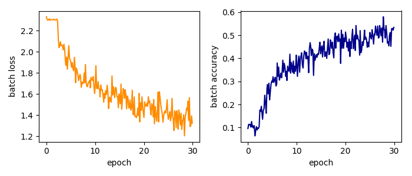

- [Second-order optimization of a sequential network on CIFAR-10](#org8d7221b)
  - [Load CIFAR-10](#org284f6cc)
  - [Model](#org256c3d3)
  - [Loss function](#orgab027e6)
  - [Optimizer](#orge7fb4a8)
  - [Run training](#org6ed3ca0)
    - [Specify the curvature matrix](#orgc20ce92)
    - [The training loop](#org6a4e164)
  - [References](#orgc7f2cba)


<a id="org8d7221b"></a>

# Second-order optimization of a sequential network on CIFAR-10

(Get the `Python` script [here](02_sequential_cifar10.py))

In this tutorial, we will extend the [previous example](01_single_layer_mnist.md) and use a larger network as well as the CIFAR-10 dataset. Again, this code aims to illustrate second-order optimization with curvature estimates obtained by Hessian backpropagation.

Let's import the stuff we need

```python
# data loading
import torchvision
import torchvision.transforms as transforms
from os import path

# layers
import torch
from torch.nn import CrossEntropyLoss
from bpexts.hbp.linear import HBPLinear
from bpexts.hbp.sigmoid import HBPSigmoid
from bpexts.hbp.relu import HBPReLU
from bpexts.hbp.sequential import HBPSequential

# for HBP
from bpexts.hbp.loss import batch_summed_hessian

# optimizer
from bpexts.optim.cg_newton import CGNewton

# auxiliary
from bpexts.utils import set_seeds
```

-   If there is a GPU on your device, we can make use of it
    
    ```python
    device = torch.device('cuda:0' if torch.cuda.is_available() else 'cpu')
    ```

-   For reproducibility, let us fix the random seed
    
    ```python
    set_seeds(0)
    ```


<a id="org284f6cc"></a>

## Load CIFAR-10

CIFAR-10 images have a resolution of 3x32x32 = 3072 pixels and are categorized into 10 different classes. Next, the dataset is downloaded and the training set loader is defined with a batch size of 500.

```python
batch_size = 500

# download directory
data_dir = '~/tmp/CIFAR10'

# training set loader
train_set = torchvision.datasets.CIFAR10(
    root=data_dir, train=True, transform=transforms.ToTensor(), download=True)
train_loader = torch.utils.data.DataLoader(
    dataset=train_set, batch_size=batch_size, shuffle=True)
```


<a id="org256c3d3"></a>

## Model

We use a fully-connected network with 5 linear layers followed by activations (except for the last layer). `bpexts` defines the layers with HBP functionality in `bpexts.hbp.linear`, `bpexts.hbp.relu`, and `bpexts.hbp.sigmoid`.

```python
# layers
linear1 = HBPLinear(in_features=3072, out_features=1024, bias=True)
activation1= HBPSigmoid()
linear2 = HBPLinear(in_features=1024, out_features=512, bias=True)
activation2 = HBPSigmoid()
linear3 = HBPLinear(in_features=512, out_features=256, bias=True)
activation3 = HBPReLU()
linear4 = HBPLinear(in_features=256, out_features=128, bias=True)
activation4 = HBPReLU()
linear5 = HBPLinear(in_features=128, out_features=10, bias=True)
```

**Note:** Because a model has to know how to backpropagate the Hessian, we need to construct a sequence of modules using the analogue to `torch.nn.Sequential`, namely the HBP version.

```python
# sequential model
model = HBPSequential(linear1,
                      sigmoid1,
                      linear2,
                      sigmoid2,
                      linear3,
                      sigmoid3,
                      linear4,
                      sigmoid4,
                      linear5)
# load to device
model.to(device)
print(model)
```

    HBPLinear: You tried to set the input Hessian approximation to True, but both approximations yield the same behavior. Resetting to None.
    HBPLinear: You tried to set the input Hessian approximation to True, but both approximations yield the same behavior. Resetting to None.
    HBPLinear: You tried to set the input Hessian approximation to True, but both approximations yield the same behavior. Resetting to None.
    HBPLinear: You tried to set the input Hessian approximation to True, but both approximations yield the same behavior. Resetting to None.
    HBPLinear: You tried to set the input Hessian approximation to True, but both approximations yield the same behavior. Resetting to None.
    HBPSequential(
      buffers: 0, hooks: 0
      (0): HBPLinear(in_features=3072, out_features=1024, bias=True, buffers: 0, hooks: 1, avg_param_jac: True)
      (1): HBPSigmoid(buffers: 0, hooks: 2, avg_input_jac: True)
      (2): HBPLinear(in_features=1024, out_features=512, bias=True, buffers: 0, hooks: 1, avg_param_jac: True)
      (3): HBPSigmoid(buffers: 0, hooks: 2, avg_input_jac: True)
      (4): HBPLinear(in_features=512, out_features=256, bias=True, buffers: 0, hooks: 1, avg_param_jac: True)
      (5): HBPSigmoid(buffers: 0, hooks: 2, avg_input_jac: True)
      (6): HBPLinear(in_features=256, out_features=128, bias=True, buffers: 0, hooks: 1, avg_param_jac: True)
      (7): HBPSigmoid(buffers: 0, hooks: 2, avg_input_jac: True)
      (8): HBPLinear(in_features=128, out_features=10, bias=True, buffers: 0, hooks: 1, avg_param_jac: True)
    )

(Ignore the messages from `HBPLinear`)


<a id="orgab027e6"></a>

## Loss function

Let us use cross-entropy as loss function.

```python
loss_func = CrossEntropyLoss()
```


<a id="orge7fb4a8"></a>

## Optimizer

We will use a Newton-Style optimizer that solves for the parameter update with the method of conjugate gradients (CG). The update rule is described in our [paper](#orgdd045cb). It can be used in the same way as `torch.optim.Optimizer` s and involves a regularization parameter &alpha; &isin; [0, 1] and a learning rate. Stopping criteria for when CG is supposed to stop can be specified by additional parameters.

```python
# learning rate
lr = 0.15

# regularization
alpha = 0.02

# convergence criteria for CG
cg_maxiter = 50
cg_atol = 0.
cg_tol = 0.1

# construct the optimizer
optimizer = CGNewton(
    model.parameters(),
    lr=lr,
    alpha=alpha,
    cg_atol=cg_atol,
    cg_tol=cg_tol,
    cg_maxiter=cg_maxiter)
```


<a id="org6ed3ca0"></a>

## Run training

That's it! We are almost ready to run the training procedure.

During the training loop, we will

1.  Perform the forward pass
2.  Compute the Hessian of the loss function with respect to the output (the 'output Hessian')
3.  Perform the backward pass to compute gradients
4.  Perform HBP of the output Hessian to obtain curvature estimates
5.  Solve for the parameter update and apply it


<a id="orgc20ce92"></a>

### Specify the curvature matrix

We can choose the curvature matrix that shall be used by the optimizer in the HBP procedure. To do so, one needs to specify a parameter that tells HBP how to proceed with second-order effects introduced by the module function.

```python
# use the PCH with absolute values of second-order module effects
modify_2nd_order_terms = 'abs' 
```

We can obtain approximations of different curvature matrices by choosing `modify_2nd_order_terms`:

-   `None`: Hessian (careful, it **might not be positive semi-definite**)
-   `zero`: Generalized Gauss-Newton matrix
-   `abs`: Positive-curvature Hessian with second-order absolute values
-   `clip`: Positive curvature Hessian with second-order clipped values


<a id="org6a4e164"></a>

### The training loop

Here is the code for the training loop. Note the two additional lines 2) and 4) required for the backpropagation of the Hessian.

```python
# train for thirty epochs
num_epochs = 30

# log some metrics
train_epoch = [ ] 
batch_loss = [ ]
batch_acc = [ ]

samples = 0
samples_per_epoch = 50000.
for epoch in range(num_epochs):
    iters = len(train_loader)

    for i, (images, labels) in enumerate(train_loader):
        # reshape and load to device
        images = images.reshape(-1, 3072).to(device)
        labels = labels.to(device)

        # 1) forward pass
        outputs = model(images)
        loss = loss_func(outputs, labels)

        # set gradients to zero
        optimizer.zero_grad()

        # Hessian backpropagation and backward pass
        # 2) batch average of Hessian of loss w.r.t. model output
        output_hessian = batch_summed_hessian(loss, outputs)
        # 3) compute gradients
        loss.backward()
        # 4) propagate Hessian back through the graph
        model.backward_hessian(
            output_hessian, modify_2nd_order_terms=modify_2nd_order_terms)

        # 5) second-order optimization step
        optimizer.step()

        # compute statistics
        total = labels.size(0)
        _, predicted = torch.max(outputs, 1)
        correct = (predicted == labels).sum().item()
        accuracy = correct / total

        # update lists every 15 iterations
        samples += total
        if i % 15 == 0:
            train_epoch.append(samples / samples_per_epoch)
            batch_loss.append(loss.item())
            batch_acc.append(accuracy)

        # print every 20 iterations
        if i % 20 == 0:
            print(
                'Epoch [{}/{}], Iter. [{}/{}], Loss: {:.4f}, Acc.: {:.4f}'.
                format(epoch + 1, num_epochs, i + 1, iters, loss.item(),
                       accuracy))
```

    Epoch [1/30], Iter. [1/100], Loss: 2.3308, Acc.: 0.0960
    Epoch [1/30], Iter. [21/100], Loss: 2.3069, Acc.: 0.0840
    Epoch [1/30], Iter. [41/100], Loss: 2.3051, Acc.: 0.0980
    Epoch [1/30], Iter. [61/100], Loss: 2.3122, Acc.: 0.1020
    Epoch [1/30], Iter. [81/100], Loss: 2.3035, Acc.: 0.0880
    Epoch [2/30], Iter. [1/100], Loss: 2.3050, Acc.: 0.1080
    Epoch [2/30], Iter. [21/100], Loss: 2.3046, Acc.: 0.0840
    Epoch [2/30], Iter. [41/100], Loss: 2.3027, Acc.: 0.0980
    Epoch [2/30], Iter. [61/100], Loss: 2.3042, Acc.: 0.0880
    Epoch [2/30], Iter. [81/100], Loss: 2.3013, Acc.: 0.1000
    Epoch [3/30], Iter. [1/100], Loss: 2.3067, Acc.: 0.0980
    Epoch [3/30], Iter. [21/100], Loss: 2.3038, Acc.: 0.1000
    Epoch [3/30], Iter. [41/100], Loss: 2.0951, Acc.: 0.1740
    Epoch [3/30], Iter. [61/100], Loss: 2.0395, Acc.: 0.1700
    Epoch [3/30], Iter. [81/100], Loss: 2.0546, Acc.: 0.2060
    Epoch [4/30], Iter. [1/100], Loss: 2.0576, Acc.: 0.1360
    Epoch [4/30], Iter. [21/100], Loss: 2.0156, Acc.: 0.2320
    Epoch [4/30], Iter. [41/100], Loss: 2.0405, Acc.: 0.2060
    Epoch [4/30], Iter. [61/100], Loss: 2.0717, Acc.: 0.2060
    Epoch [4/30], Iter. [81/100], Loss: 1.9794, Acc.: 0.2000
    Epoch [5/30], Iter. [1/100], Loss: 1.8720, Acc.: 0.2860
    Epoch [5/30], Iter. [21/100], Loss: 1.9733, Acc.: 0.2320
    Epoch [5/30], Iter. [41/100], Loss: 2.0254, Acc.: 0.2640
    Epoch [5/30], Iter. [61/100], Loss: 2.0588, Acc.: 0.2580
    Epoch [5/30], Iter. [81/100], Loss: 1.8606, Acc.: 0.2760
    Epoch [6/30], Iter. [1/100], Loss: 1.9032, Acc.: 0.2960
    Epoch [6/30], Iter. [21/100], Loss: 1.8761, Acc.: 0.3080
    Epoch [6/30], Iter. [41/100], Loss: 1.8102, Acc.: 0.3100
    Epoch [6/30], Iter. [61/100], Loss: 1.8196, Acc.: 0.3180
    Epoch [6/30], Iter. [81/100], Loss: 1.8045, Acc.: 0.3560
    Epoch [7/30], Iter. [1/100], Loss: 1.7082, Acc.: 0.3800
    Epoch [7/30], Iter. [21/100], Loss: 1.8221, Acc.: 0.3220
    Epoch [7/30], Iter. [41/100], Loss: 1.8469, Acc.: 0.3100
    Epoch [7/30], Iter. [61/100], Loss: 1.7289, Acc.: 0.3200
    Epoch [7/30], Iter. [81/100], Loss: 1.7413, Acc.: 0.3520
    Epoch [8/30], Iter. [1/100], Loss: 1.7606, Acc.: 0.3380
    Epoch [8/30], Iter. [21/100], Loss: 1.7644, Acc.: 0.3180
    Epoch [8/30], Iter. [41/100], Loss: 1.7541, Acc.: 0.3580
    Epoch [8/30], Iter. [61/100], Loss: 1.7056, Acc.: 0.3600
    Epoch [8/30], Iter. [81/100], Loss: 1.7390, Acc.: 0.3560
    Epoch [9/30], Iter. [1/100], Loss: 1.8793, Acc.: 0.3040
    Epoch [9/30], Iter. [21/100], Loss: 1.7509, Acc.: 0.3520
    Epoch [9/30], Iter. [41/100], Loss: 1.6736, Acc.: 0.3880
    Epoch [9/30], Iter. [61/100], Loss: 1.7113, Acc.: 0.4180
    Epoch [9/30], Iter. [81/100], Loss: 1.6578, Acc.: 0.3820
    Epoch [10/30], Iter. [1/100], Loss: 1.6592, Acc.: 0.3680
    Epoch [10/30], Iter. [21/100], Loss: 1.6786, Acc.: 0.3660
    Epoch [10/30], Iter. [41/100], Loss: 1.7744, Acc.: 0.3840
    Epoch [10/30], Iter. [61/100], Loss: 1.7655, Acc.: 0.3660
    Epoch [10/30], Iter. [81/100], Loss: 1.5660, Acc.: 0.4200
    Epoch [11/30], Iter. [1/100], Loss: 1.6627, Acc.: 0.3740
    Epoch [11/30], Iter. [21/100], Loss: 1.7363, Acc.: 0.3460
    Epoch [11/30], Iter. [41/100], Loss: 1.7183, Acc.: 0.3660
    Epoch [11/30], Iter. [61/100], Loss: 1.7180, Acc.: 0.3400
    Epoch [11/30], Iter. [81/100], Loss: 1.6180, Acc.: 0.4140
    Epoch [12/30], Iter. [1/100], Loss: 1.5728, Acc.: 0.4240
    Epoch [12/30], Iter. [21/100], Loss: 1.6549, Acc.: 0.3880
    Epoch [12/30], Iter. [41/100], Loss: 1.6158, Acc.: 0.3960
    Epoch [12/30], Iter. [61/100], Loss: 1.6011, Acc.: 0.4320
    Epoch [12/30], Iter. [81/100], Loss: 1.6188, Acc.: 0.4060
    Epoch [13/30], Iter. [1/100], Loss: 1.5607, Acc.: 0.4260
    Epoch [13/30], Iter. [21/100], Loss: 1.5403, Acc.: 0.4280
    Epoch [13/30], Iter. [41/100], Loss: 1.4958, Acc.: 0.4260
    Epoch [13/30], Iter. [61/100], Loss: 1.6220, Acc.: 0.4420
    Epoch [13/30], Iter. [81/100], Loss: 1.6178, Acc.: 0.3980
    Epoch [14/30], Iter. [1/100], Loss: 1.5711, Acc.: 0.4120
    Epoch [14/30], Iter. [21/100], Loss: 1.7189, Acc.: 0.3660
    Epoch [14/30], Iter. [41/100], Loss: 1.8518, Acc.: 0.2960
    Epoch [14/30], Iter. [61/100], Loss: 1.5913, Acc.: 0.4200
    Epoch [14/30], Iter. [81/100], Loss: 1.6009, Acc.: 0.4300
    Epoch [15/30], Iter. [1/100], Loss: 1.5662, Acc.: 0.4160
    Epoch [15/30], Iter. [21/100], Loss: 1.5281, Acc.: 0.4720
    Epoch [15/30], Iter. [41/100], Loss: 1.5365, Acc.: 0.4380
    Epoch [15/30], Iter. [61/100], Loss: 1.5799, Acc.: 0.4400
    Epoch [15/30], Iter. [81/100], Loss: 1.5927, Acc.: 0.4360
    Epoch [16/30], Iter. [1/100], Loss: 1.5686, Acc.: 0.4380
    Epoch [16/30], Iter. [21/100], Loss: 1.4483, Acc.: 0.4840
    Epoch [16/30], Iter. [41/100], Loss: 1.4359, Acc.: 0.4780
    Epoch [16/30], Iter. [61/100], Loss: 1.5629, Acc.: 0.4740
    Epoch [16/30], Iter. [81/100], Loss: 1.5297, Acc.: 0.4140
    Epoch [17/30], Iter. [1/100], Loss: 1.5593, Acc.: 0.4280
    Epoch [17/30], Iter. [21/100], Loss: 1.5617, Acc.: 0.4340
    Epoch [17/30], Iter. [41/100], Loss: 1.4713, Acc.: 0.4780
    Epoch [17/30], Iter. [61/100], Loss: 1.5817, Acc.: 0.4160
    Epoch [17/30], Iter. [81/100], Loss: 1.4413, Acc.: 0.5040
    Epoch [18/30], Iter. [1/100], Loss: 1.4718, Acc.: 0.4700
    Epoch [18/30], Iter. [21/100], Loss: 1.5628, Acc.: 0.4520
    Epoch [18/30], Iter. [41/100], Loss: 1.4659, Acc.: 0.4620
    Epoch [18/30], Iter. [61/100], Loss: 1.6369, Acc.: 0.4020
    Epoch [18/30], Iter. [81/100], Loss: 1.5269, Acc.: 0.4600
    Epoch [19/30], Iter. [1/100], Loss: 1.5731, Acc.: 0.4440
    Epoch [19/30], Iter. [21/100], Loss: 1.5182, Acc.: 0.4680
    Epoch [19/30], Iter. [41/100], Loss: 1.4897, Acc.: 0.4740
    Epoch [19/30], Iter. [61/100], Loss: 1.4089, Acc.: 0.5060
    Epoch [19/30], Iter. [81/100], Loss: 1.6404, Acc.: 0.4240
    Epoch [20/30], Iter. [1/100], Loss: 1.6073, Acc.: 0.3780
    Epoch [20/30], Iter. [21/100], Loss: 1.5557, Acc.: 0.4400
    Epoch [20/30], Iter. [41/100], Loss: 1.6068, Acc.: 0.4260
    Epoch [20/30], Iter. [61/100], Loss: 1.5738, Acc.: 0.4440
    Epoch [20/30], Iter. [81/100], Loss: 1.4473, Acc.: 0.4860
    Epoch [21/30], Iter. [1/100], Loss: 1.3780, Acc.: 0.5140
    Epoch [21/30], Iter. [21/100], Loss: 1.4560, Acc.: 0.4620
    Epoch [21/30], Iter. [41/100], Loss: 1.4692, Acc.: 0.4680
    Epoch [21/30], Iter. [61/100], Loss: 1.5137, Acc.: 0.4320
    Epoch [21/30], Iter. [81/100], Loss: 1.3739, Acc.: 0.5000
    Epoch [22/30], Iter. [1/100], Loss: 1.5169, Acc.: 0.4720
    Epoch [22/30], Iter. [21/100], Loss: 1.4264, Acc.: 0.4920
    Epoch [22/30], Iter. [41/100], Loss: 1.4821, Acc.: 0.4380
    Epoch [22/30], Iter. [61/100], Loss: 1.5098, Acc.: 0.4420
    Epoch [22/30], Iter. [81/100], Loss: 1.4573, Acc.: 0.4660
    Epoch [23/30], Iter. [1/100], Loss: 1.5490, Acc.: 0.4340
    Epoch [23/30], Iter. [21/100], Loss: 1.3737, Acc.: 0.5020
    Epoch [23/30], Iter. [41/100], Loss: 1.4096, Acc.: 0.4860
    Epoch [23/30], Iter. [61/100], Loss: 1.3441, Acc.: 0.4820
    Epoch [23/30], Iter. [81/100], Loss: 1.4126, Acc.: 0.4940
    Epoch [24/30], Iter. [1/100], Loss: 1.3379, Acc.: 0.5200
    Epoch [24/30], Iter. [21/100], Loss: 1.3739, Acc.: 0.4960
    Epoch [24/30], Iter. [41/100], Loss: 1.2762, Acc.: 0.5620
    Epoch [24/30], Iter. [61/100], Loss: 1.4518, Acc.: 0.4560
    Epoch [24/30], Iter. [81/100], Loss: 1.4787, Acc.: 0.4860
    Epoch [25/30], Iter. [1/100], Loss: 1.3775, Acc.: 0.4820
    Epoch [25/30], Iter. [21/100], Loss: 1.4749, Acc.: 0.5120
    Epoch [25/30], Iter. [41/100], Loss: 1.4501, Acc.: 0.4760
    Epoch [25/30], Iter. [61/100], Loss: 1.4610, Acc.: 0.4700
    Epoch [25/30], Iter. [81/100], Loss: 1.3451, Acc.: 0.5240
    Epoch [26/30], Iter. [1/100], Loss: 1.3618, Acc.: 0.5120
    Epoch [26/30], Iter. [21/100], Loss: 1.3716, Acc.: 0.4960
    Epoch [26/30], Iter. [41/100], Loss: 1.4339, Acc.: 0.5180
    Epoch [26/30], Iter. [61/100], Loss: 1.3973, Acc.: 0.4980
    Epoch [26/30], Iter. [81/100], Loss: 1.4560, Acc.: 0.5000
    Epoch [27/30], Iter. [1/100], Loss: 1.3616, Acc.: 0.5000
    Epoch [27/30], Iter. [21/100], Loss: 1.3352, Acc.: 0.5100
    Epoch [27/30], Iter. [41/100], Loss: 1.2844, Acc.: 0.5360
    Epoch [27/30], Iter. [61/100], Loss: 1.2837, Acc.: 0.5400
    Epoch [27/30], Iter. [81/100], Loss: 1.2656, Acc.: 0.5460
    Epoch [28/30], Iter. [1/100], Loss: 1.2683, Acc.: 0.5420
    Epoch [28/30], Iter. [21/100], Loss: 1.3769, Acc.: 0.5380
    Epoch [28/30], Iter. [41/100], Loss: 1.3039, Acc.: 0.5280
    Epoch [28/30], Iter. [61/100], Loss: 1.4191, Acc.: 0.4700
    Epoch [28/30], Iter. [81/100], Loss: 1.3875, Acc.: 0.5000
    Epoch [29/30], Iter. [1/100], Loss: 1.3528, Acc.: 0.5240
    Epoch [29/30], Iter. [21/100], Loss: 1.3863, Acc.: 0.5220
    Epoch [29/30], Iter. [41/100], Loss: 1.3360, Acc.: 0.5560
    Epoch [29/30], Iter. [61/100], Loss: 1.4130, Acc.: 0.4660
    Epoch [29/30], Iter. [81/100], Loss: 1.4147, Acc.: 0.5140
    Epoch [30/30], Iter. [1/100], Loss: 1.5335, Acc.: 0.4980
    Epoch [30/30], Iter. [21/100], Loss: 1.4795, Acc.: 0.4880
    Epoch [30/30], Iter. [41/100], Loss: 1.3046, Acc.: 0.5340
    Epoch [30/30], Iter. [61/100], Loss: 1.2974, Acc.: 0.5300
    Epoch [30/30], Iter. [81/100], Loss: 1.4010, Acc.: 0.5380

Let's plot our results.

```python
# plotting
import matplotlib
matplotlib.use('Agg')
import matplotlib.pyplot as plt

plt.subplots(121, figsize=(7,3))

# plot batch loss
plt.subplot(121)
plt.plot(train_epoch, batch_loss, color='darkorange')
plt.xlabel('epoch')
plt.ylabel('batch loss')

# plot batch accuracy
plt.subplot(122)
plt.plot(train_epoch, batch_acc, color='darkblue')
plt.xlabel('epoch')
plt.ylabel('batch accuracy')

# save plot
plt.tight_layout()
plt.savefig('02_sequential_cifar10_metrics.png')
```




<a id="orgc7f2cba"></a>

## References

-   <a id="orgdd045cb"></a> [[1](#orgdd045cb)] Dangel, F. and Hennig, P.: [A Modular Approach to Block-diagonal Hessian Approximations for Second-order Optimization](https://arxiv.org/abs/1902.01813) (2019)
